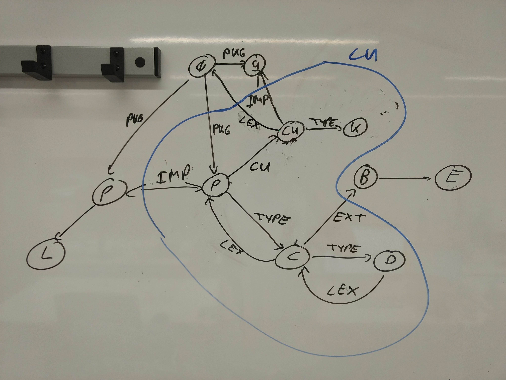

# Scoping Structure of Java in Mini-Statix

## Visibility of Type Names (JLS'11)

Type name visibility:

    ----------------------------------------------------------------------------
    | name                              | visible in                           |
    ----------------------------------------------------------------------------
    | single import                     | compilation unit                     |
    | top-level class                   | all type decls of the same package   |
    | declared or inherited type member | type decl body and nested type decls |
    | on-demand import                  | compilation unit                     |
    ----------------------------------------------------------------------------

Shadowing between type names:

      nested and inherited type decls
    < (compilation unit type decls | simple imported classes)
    < same package classes
    < on-demand imported classes

## Scoping Structure

Example program:

    package p;
    import r.K;
    import q.*;
    class C extends B {
      class D {}
    }

Scope graph structure of a compilation unit:

Regular expression and label order:

    MEM-PKG-RE = `PKG
    LEX-PKG-RE = `LEX* `CU `LEX* MEM-PKG-RE
    PKG-ORD    = `PKG < `LEX

    MEM-TYPE-RE = `EXT* `IMPL* `TYPE
    LEX-TYPE-RE = `LEX* `CU? `IMP? MEM-TYPE-RE
    TYPE-ORD    = `TYPE < `LEX, `TYPE < `EXT, `TYPE < `IMP, `TYPE < `IMPL, `EXT < `LEX, `IMPL < `LEX, `IMP < `LEX

    MEM-TYPE-OR-PKG-RE  = MEM-PKG-RE | MEM-TYPE-RE
    LEX-TYPE-OR-PKG-RE  = LEX-PKG-RE | LEX-TYPE-RE
    PKG-OR-TYPE-ORD = PKG-ORD, TYPE-ORD, `TYPE < `PKG
    //              = (.* `TYPE < .* `PKG) <+ PKG-ORD, TYPE-ORD

    MEM-EXPR-RE = `EXT* (`VAR|`FIELD)
    LEX-EXPR-RE = `LEX* MEM-EXPR-RE
    EXPR-ORD    = `VAR < `LEX, `FIELD < `LEX, `VAR < `EXT, `FIELD < `EXT, `EXT < `LEX

    AMB-RE  = LEX-EXPR-RE | LEX-PKG-OR-TYPE-RE
    AMB-ORD = EXPR-ORD, PKG-OR-TYPE-ORD, `VAR < `TYPE, `FIELD < `TYPE
    //      = (.* (`VAR|`FIELD) < .* `TYPE < .* `PKG) <+ PKG-OR-TYPE-ORD, EXPR-ORD

    `EXT ~ `IMPL are the ordered?
    `EXT ~ `IMP irrelevant
    `LEX ~ `CU should be unordered
